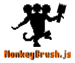
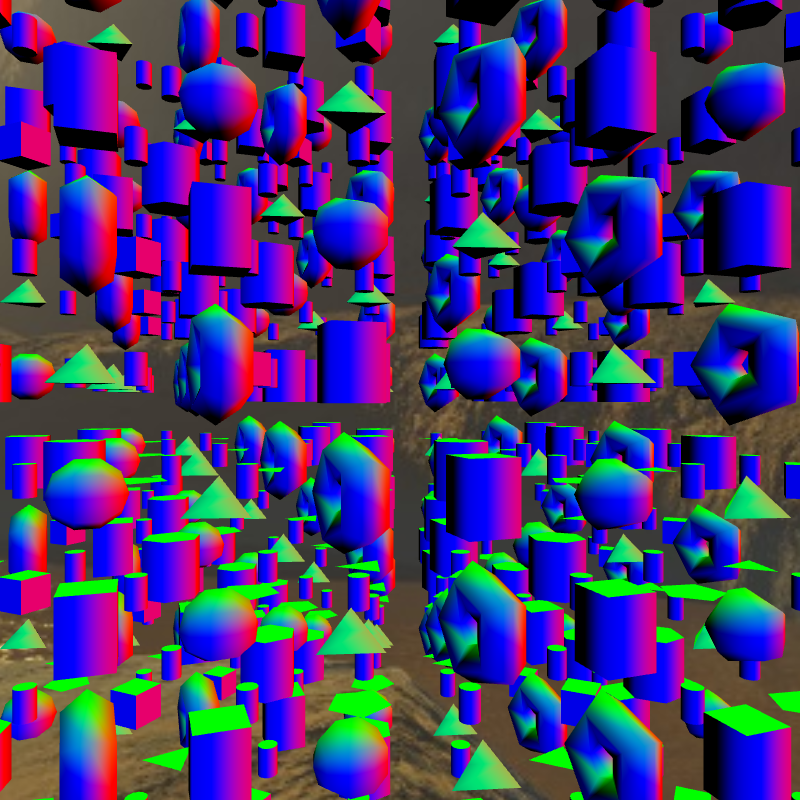

# monkeybrush.js


Monkey Brush is a library that adds OOP for WebGL 1/2 using Typescript

## init
```bash
npm install && bower install
npm start # Open server in 3000 port
npm script build # Compile project
tslint lib/**/*.ts --exclude lib/**/*.d.ts > tslintwarnings.txt # Check TSlint rules
```
<div style="width: 100%">
    
    
    
    
    
    
    
    
    
    
    
    
    
</div>

## Doc
<a href="./tutorials.md">Doc</a>

## TODO

### Models
- [x] Add quad/plane model
- [x] Add cube model
- [x] Add sphere model
- [x] Add torus model
- [x] Add cone model
- [x] Add prism model
- [x] Add cylinder model
- [x] Add disc model
- [x] Add icosphere model
- [x] Add capsule model
- [x] Add object parser (faces: x1/y1/z1 x2/y2/z2 x3/y3/z3)
- [x] Add custom model (indices, vertices, normals and texcoords list)
- [ ] Add glTF (https://github.com/KhronosGroup/glTF)

### Cameras
- [x] Perspective Camera
- [x] Orthographic Camera
- [ ] Orbit Camera
- [ ] Free Camera (FPS Camera)
- [ ] Cube Camera

### Shading lighting
- [x] Phong shading
- [x] Blinn-Phong shading
- [x] Gaussian shading
- [x] Oren-Nayar shading
- [x] Benckmann shading
- [ ] Ward shading
- [ ] Cook-Torrance shading

### Textures
- [x] Add texture 2D
- [x] Add texture 2D array
- [x] Add texture 3D
- [x] Add framebuffer
- [x] Inmutable textures
- [x] Video texture
- [x] Webcam texture
- [ ] Compressed texture

### WebGL2
- [x] Transform feedback
- [x] Occlusion Query
- [x] Query object
- [x] Sampler object
- [x] Sync object
- [x] UBO (projection, view example)

### Maths
- [x] Vect2
- [x] Vect3
- [x] Vect3
- [x] Quaternion
- [x] Mat2
- [x] Mat3
- [x] Mat4
- [x] Box2D
- [x] Box3D
- [x] DoubleLinkedList (List)
- [x] Transpose matrix GLSL (WebGL1)
- [x] Inverse matrix GLSL (WebGL1)
- [x] Spline2D
- [x] Spline3D
- [ ] SIMD instructions

### Resources
- [x] Audio supporting (Background)
- [x] Audio supporting (SimpleAudio)
- [x] HDR images supporting
- [x] Image upload
- [x] Skybox supporting
- [x] Video loader
- [x] Webcam loader
- [ ] Fonts
- [ ] Generate video capture

### Lights
- [x] Directional Light
- [x] Point Light
- [x] Spot Light
- [x] Ambient Light
- [x] Hemispheric Light

### Core
- [x] App class
- [x] Key input
- [x] Mouse input
- [x] Easing functions
- [x] VertexArray class
- [x] Instancing
- [ ] GlobalState
- [ ] Sprites (HUD)
- [ ] Picking
- [ ] Multi context
- [ ] PBO (http://www.songho.ca/opengl/gl_pbo.html#create)

### Polyfills
- [x] Epsilon
- [x] SmallEpsilon
- [x] Default IOR (air)
- [x] Element DOM remove
- [ ] Array remove by index

### Others
- [x] Skybox
- [x] Easing functions
- [x] Noise generator
- [x] Clock
- [x] Billboard
- [x] WebVR supporting
- [x] Enconding


### Development
- [x] Grunt integration
- [x] Webpack integration
- [x] Typescript definition file for WebGL2RenderingContext
- [x] Shader uniforms and attributes extraction
- [x] Clean project generator (Simple project gen.) (https://github.com/maldicion069/monkeybrush-generator)
- [ ] MonkeyBrush-frags (Two triangles rendering!) (https://github.com/maldicion069/monkeybrush-frags)

### Demos
- [x] Rim Lighting
- [x] Deferred Shading
- [x] Tone mapping
- [x] Skybox reflection and refraction
- [x] Spherical Harmonics
- [x] Heightmap
- [ ] Texture LOD DEMO
- [ ] Normal Mapping
- [ ] Bump Mapping
- [ ] Tiled Deferred Shading
- [ ] SSAO
- [ ] HDR
- [ ] Basic Transparency
- [ ] Woit Transparency
- [ ] Simple Shadow
- [ ] Create "shadertoy" for desktop

### Help
> - tslint lib/**/*.ts --exclude lib/**/*.d.ts > tslintwarnings.txt
> - https://www.npmjs.com/package/webpack-glsl-loader
> - http://www.jbrantly.com/es6-modules-with-typescript-and-webpack/
